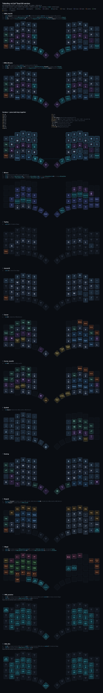

# Go60 layer visualizer

A dependency-free viewer for **MoErgo Go60** layouts. Open `index.html`; no
build step, no server, no npm.

```sh
node tools/bake.js     # bake layouts/<newest> into the page
open index.html
```

Drag a config onto the window at any time — that wins over the baked one and
sticks in `localStorage`. Press **Reload** to drop it.

## The cheat sheet

The whole layout as **one tall image**, sized for a vertical monitor: every
layer, how you get in and out of each one (read off the keymap, so it can't go
stale), the combos, and the Mouse layer with its Slow/Warp/Fast speed holds.

Three ways to read it, most-locked-down network first:

1. **This page** — [`docs/cheatsheet.svg`](docs/cheatsheet.svg) is embedded
   below, so anywhere github.com loads, the sheet loads. No Pages, no JS.
2. **`cheatsheet.html`** — same sheet, rendered live from the baked layout
   (also honours a layout loaded in the viewer). Works from a local checkout,
   or via GitHub Pages once enabled (Settings → Pages → deploy from `main`):
   <https://bs7280.github.io/moergo_g60_layout/cheatsheet.html>
3. **Backup — the stock TailorKey PDF** on Google Drive:
   <https://drive.google.com/file/d/1sZt1x4raxNtoy_JkDxRJWSpbNrtAcakZ/view>.
   TailorKey's own docs live on Google Sites, which some corporate networks
   block; the Drive PDF usually still loads. It shows stock TailorKey, not
   this layout's changes — the SVG above is the authoritative one.

Regenerate after changing a layout:

```sh
node tools/cheatsheet.js     # layouts/<newest> -> docs/cheatsheet.svg
```



## Go60 only, and loud about it

This is a personal tool for one keyboard. Rather than degrade gracefully on
anything else, it refuses to render and says why:

| Rejected | Because |
| --- | --- |
| `keyboard` isn't `go60` | wrong physical geometry |
| any layer isn't exactly 60 bindings | not a Go60 keymap; nothing is padded |
| legacy export (`custom_defined_behaviors` / `custom_devicetree` non-empty) | behaviours live in a different place entirely |
| a binding references an undefined behaviour | its parameters can't be interpreted |
| a combo's key positions or layers don't resolve | a `#define` is missing |

That last pair is the point. An unrecognised binding still *renders* — as a
prettified version of its own name — so a wrong picture looks exactly like a
right one. `&mod_tab_v2_TKZ LCTRL` reads as "Tab" when it is actually Ctrl.
Parameters are positional and meaningless without the definition: in
`&thumb_v2_TKZ 5 BSPC`, the `5` is a layer only because that hold-tap's
bindings are `<&mo, &kp>`. So an undefined behaviour is a hard failure, not a
guess. Errors appear as a banner in the browser and on stderr with exit 1 from
the CLI.

## What it reads

| Format | Where it comes from |
| --- | --- |
| `.keymap` | ZMK devicetree — the file the firmware actually builds from |
| `.json` | my.moergo.com/go60 → your layout → **Export** |

Both are fully supported and produce identical legends; they're cross-checked
against each other in `tools/` usage below. Two differences worth knowing:

- The **`.keymap` is more faithful.** MoErgo's JSON export strips `&magic`'s
  parameters, so the JSON can't tell you which layer that key holds for. The
  keymap keeps `&magic LAYER_Magic 0`.
- The **JSON has prose.** Combo and behaviour descriptions survive as data;
  in the keymap they're comments.

Devicetree parsing covers `combos { }` (resolving `#define`d key positions and
layer names), hold-tap `bindings`/`tapping-term-ms`/`flavor`, macros, and the
`ZMK_TD_LAYER(name, layer)` preprocessor macro. Structured JSON parsing covers
`holdTaps`, `macros`, `combos`, and `inputListeners`.

## The board

Key positions come from MoErgo's own physical layout (via keymap-drawer's
`resources/extra_layouts/go60.json`), so the render is dimensionally true — the
curved column stagger, the three-key bottom row per half, and the real 15°/30°/45°
thumb-arc rotations. Legends are counter-rotated so the thumb cluster stays
readable while the caps keep their true angle.

Position index = ZMK key-position index = the order bindings appear inside
`bindings = < … >`. Toggle **#** to see them on the caps.

## Interaction

| | |
| --- | --- |
| `0`–`9`, `←` `→` | switch layer |
| click a key | its binding on *every* layer, plus any combos it belongs to |
| hover a layer key | peeks at that layer (toggle with **Peek**) |
| `/` | search — matches raw ZMK text, legends, and descriptions, and reports which layers hit |
| **Combos** | overlay every combo on this layer; otherwise only the selected key's |
| **Ghost ▽** | show what each `&trans` key inherits from below |
| **Copy** | current layer as aligned plain text |
| `index.html#2` | deep-link straight to a layer |

`&trans` resolution walks down to the first non-transparent binding, ending at
the base layer. ZMK actually resolves against whichever lower layers happen to
be active, so treat it as the common case, not gospel.

Shifted keys show what they type: `LS(N9)` renders as **⇧ (**. That mapping is
US-layout (this layout's `locale` is `en-US`); the ⇧ marker is always kept.

## CLI

Same parser, terminal output — for answering questions without a browser.

```sh
node tools/keymap.js layers          # board, layer list, combo count
node tools/keymap.js show 4          # one layer as an aligned grid
node tools/keymap.js all             # every layer
node tools/keymap.js find bootloader # where is this bound?
node tools/keymap.js key 54          # one position across all layers
node tools/keymap.js stats           # per-layer key counts by category
node tools/keymap.js combos          # combos, their keys and layers
node tools/keymap.js behaviors       # hold-taps with term/quick/idle/flavor, and macros
```

Reads the newest file in `layouts/`, or `--file=PATH`. `G80_OS=pc` swaps ⌘/⌥
for Win/Alt.

## WM cheat sheet

`wm.html` draws the WM layer as **what it does** rather than what it emits —
the join between "position 31 emits F13" (your layout) and "F13 means send this
window to the left monitor" (`data/wm-actions.js`). Neither file knows the
other; joining them on the keycode means rebinding a key and re-baking moves
every label with it.

The board shows both hands, dimming everything that isn't part of the layer.
Dashed caps are the keys that get you in, orange ones the way out — all read
off the keymap, so they can't go stale either. **Actions** cycles the caps
between intent, F-key and base-layer letter.

Underneath is the table you bind from. There are two WM layers — `WM_practice`
sends F-keys for macOS, `WM_Win` sends native `Win`+chords — so it gets a
column each, showing what that layer actually emits at that position plus what
you still have to configure. The twin is found by position overlap and binding
density, not by name, so a third one would appear on its own.

## Mouse follows the keyboard

The Magic-layer BT keys also move the MX Master 3S: each taps a reserved
hotkey (`Ctrl+Shift+F17`–`F19`) before hopping, and a small listener on every
machine turns that into an HID++ `ChangeHost` push — the mouse lands on the
same machine the keyboard just went to, no flipping it over. Keyboard side is
`tools/edits/bt-mouse-follow.js`; per-machine setup, scripts, and the raw
HID++ bytes live in [`host-switch/`](host-switch/). Nothing in it needs admin
rights, deliberately.

## Firmware

The keyboard builds from this repo — no my.moergo.com in the loop except to
convert layout JSON to a `.keymap` export. `firmware/` is vendored from
MoErgo's open-source [go60-zmk-config](https://github.com/moergo-keyboards/go60-zmk-config)
template; see [`firmware/README.md`](firmware/README.md) for local builds.

```sh
node tools/firmware-sync.js    # layouts/<newest .keymap> -> firmware/config/
git commit && git push         # Actions builds and publishes go60.uf2
tools/flash.sh                 # download, wait for bootloader drive, flash both halves
```

Every push that touches `firmware/` rebuilds and re-points the rolling
[`firmware-latest`](https://github.com/bs7280/moergo_g60_layout/releases/tag/firmware-latest)
release, so the uf2 lives at a permanent URL. The sync script refuses a
keymap older than the newest layout JSON — stale exports don't get to become
firmware.

## Practice mode

`practice.html` drills **intent → physical key** for the WM layer. What the key
emits is deliberately not what's trained: the same finger motion has to survive
the move from `LG(...)` chords to hyper chords to F-keys, so the position is
the thing worth memorising.

The layer is mirrored — hold `G` and the right hand acts, hold `H` and the left
hand does — so each action has two positions and **either one counts**. Both
light up on the board. In `F13–F24` mode this is automatic (the browser sees
`F17`, not which key sent it); in `base` and `click` modes both are accepted
explicitly. See [PLAN.md](PLAN.md) for why it's a spatial copy rather than a
same-finger mirror.

It's the join from the design doc — the layout knows *position → F-key*,
`data/wm-actions.js` knows *F-key → intent*, and the drill is the composition.
Edit that file to change the actions; it's config, not code.

**You can drill before flashing anything.** Three input sources:

| Source | Needs | Fidelity |
| --- | --- | --- |
| `F13–F24` | the WM layer flashed | real — actual keys, actual layer hold |
| `base layer` | nothing | same finger, same motion; the letter is mapped back to a position via your layout |
| `click` | nothing | learning the map, not drilling it |

`Auto` picks F-keys if a layer in your layout binds F13–F24 (positions are then
read from that layer, not from the config), otherwise base-layer mode.

The drill used to be a rehearsal for chords a browser could never observe — the
OS eats `Win+Left` and hyper chords before a page sees them. That's no longer
true: with Rectangle and PowerToys consuming F-keys directly, there's one layer
emitting F-keys everywhere, so what you drill here is exactly what fires.

The layer stays inside **F13–F20**, with the verb row on `LS(F13)`–`LS(F16)`.
macOS has no Carbon keycode for F21–F24, so nothing there can be bound to them
— see [PLAN.md](PLAN.md).

Wrong answers are informative: pressing a non-practice key still counts, so a
hold-tap misfire shows up as a wrong answer rather than being swallowed.
Sampling is weighted toward what you miss or are slow on. **Reveal** shows the
map; **Esc** restarts.

## Diffing

```sh
node tools/diff.js OLD NEW              # what changed, in layout terms
node tools/diff.js OLD NEW --semantic   # ignore spelling, compare meaning
```

Reports layer adds/removes/**moves** (which silently re-point every numeric
`&mo`/`&to`/combo reference), per-position binding changes with legends, combo
changes, and hold-tap timing changes — instead of `{"value":"&kp"...}` noise:

```
Layer 0  HRM_macOS   (1 key)
  #29 L r2 index-inner
    - &kp G     (G)
    + &lt 6 G   (Symbol / G)

Combos
  ~ capslock_v1_TKZ  layers HRM_macOS, Autoshift -> HRM_macOS, HRM_WinLinx, Autoshift

Behaviours
  ~ &space_v3_TKZ  requirePriorIdle — -> 100
```

Layers are matched **by name**, so appending one doesn't show up as 60 changed
keys on every layer after it.

`--semantic` compares what a key *does* rather than how it's written, which is
what you want across formats: `&mo 11` and `&mo LAYER_MouseFast` are the same
key. Diffing your `.json` against your `.keymap` this way is a good parser
regression check — it should report only the `&magic` positions.

## Layout

```
PLAN.md               WM project state, decisions and next steps
index.html            layer viewer
cheatsheet.html       every layer on one tall page (vertical monitor)
wm.html               WM cheat sheet — the layer as what it does
practice.html         WM motion drills
css/app.css           theming (dark + light) and keycap styles
js/geometry.js        Go60 physical layout, rows, fingers, bounds math
js/keycodes.js        ZMK binding -> legend/category/description
js/parse.js           .keymap devicetree + MoErgo JSON parsers, and validation
js/render.js          SVG board builder
js/app.js             viewer UI wiring
js/sheet.js           full-layout sheet as one SVG, shared by page and CLI
js/wmjoin.js          position -> F-key -> intent, shared by the sheet and drill
js/wmsheet.js         WM cheat-sheet page
js/practice.js        drill logic
data/wm-actions.js    F-key -> intent map (edit this)
data/layout.js        generated by tools/bake.js (committed so the pages work hosted)
docs/cheatsheet.svg   generated by tools/cheatsheet.js, embedded in this README
firmware/             the uf2 builds from here (vendored go60-zmk-config)
tools/keymap.js       CLI
tools/bake.js         layouts/<newest> -> data/layout.js
tools/cheatsheet.js   layouts/<newest> -> docs/cheatsheet.svg
tools/firmware-sync.js  layouts/<newest .keymap> -> firmware/config/go60.keymap
tools/flash.sh        download the built uf2, flash both halves
tools/diff.js         what changed between two exports
tools/edits/          scripted, reviewable layout edits (run, then diff)
tools/rectangle-config.js  WM F-keys -> a Rectangle config you can import
tools/macos-shortcuts.js   checks the keys macOS owns, not Rectangle
layouts/              drop your exports here
config/               generated OS-side config (Rectangle) + what's set by hand
```

The JS files are UMD-ish: classic `<script>` globals in the browser,
`require()`-able in Node, so browser and CLI share one implementation. No
bundler, which also means wrapping this in Tauri or a WKWebView later is just
pointing a webview at `index.html`.

## Not handled yet

- `inputListeners` (pointer speed per layer — MouseSlow/Fast/Warp are 60/60
  `&trans` and exist only to scale pointer speed) are parsed onto the model but
  not surfaced in the UI.
- Mod-morph internals and `&macro_param` substitution aren't expanded; macros
  show their payload keycode and description.
- Only `ZMK_TD_LAYER` is expanded. Any other function-like macro that defines a
  behaviour will trip the undefined-behaviour check rather than be guessed at.
- No PNG export — `tools/cheatsheet.js` covers the image case with SVG;
  **Copy** gives you text.
